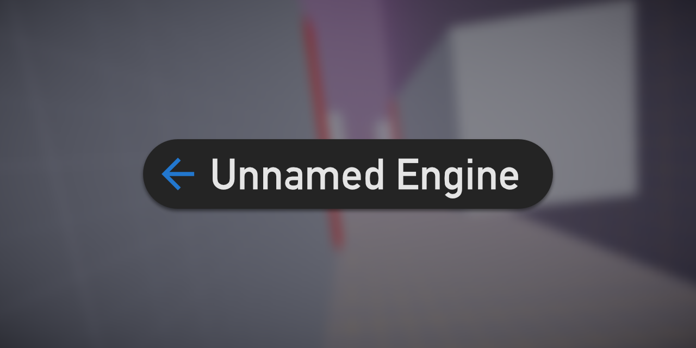

## Unnamed Engine

Unnamed Engine は C++ / DirectX 12 を使用したゲームエンジンです。

略しちゃダメです。E◯ic Gamesに怒られます。

## ドキュメント

- [はじめに](gettingstarted.md)
- [新規ゲーム作成ガイド](create-new-game.md)
- [エンジン内蔵コンポーネント](engine-components.md)
- [コンポーネントドキュメントテンプレート](component-template.md)
